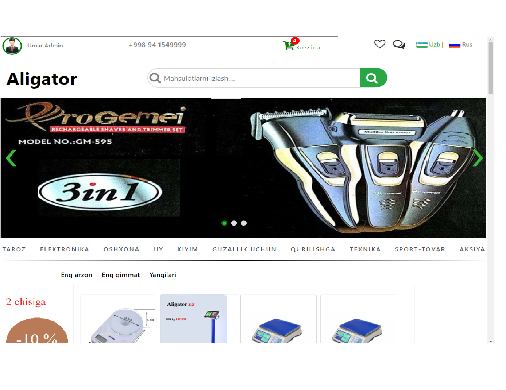
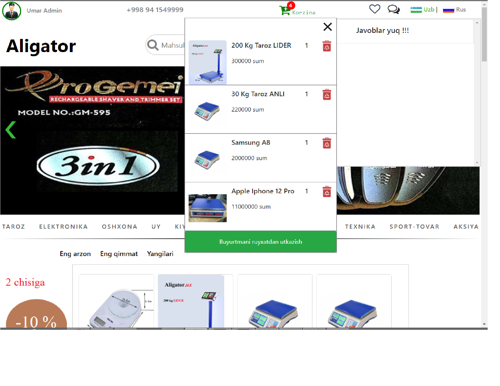
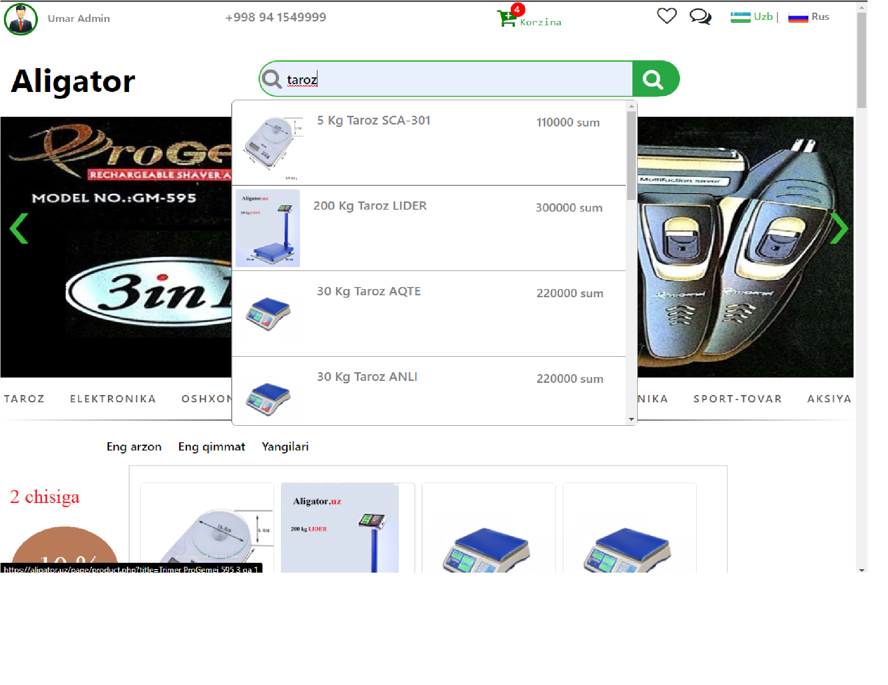
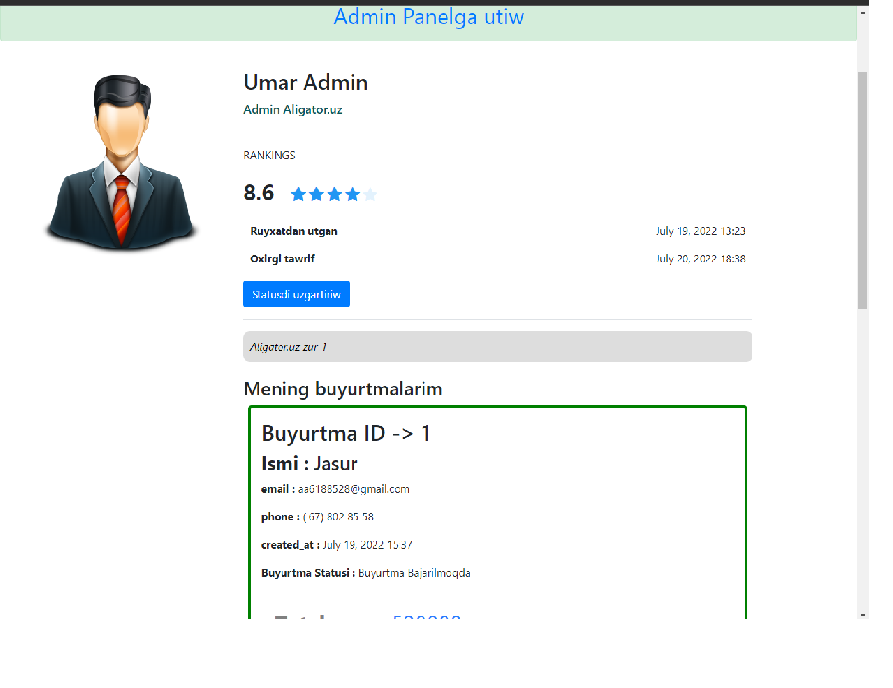
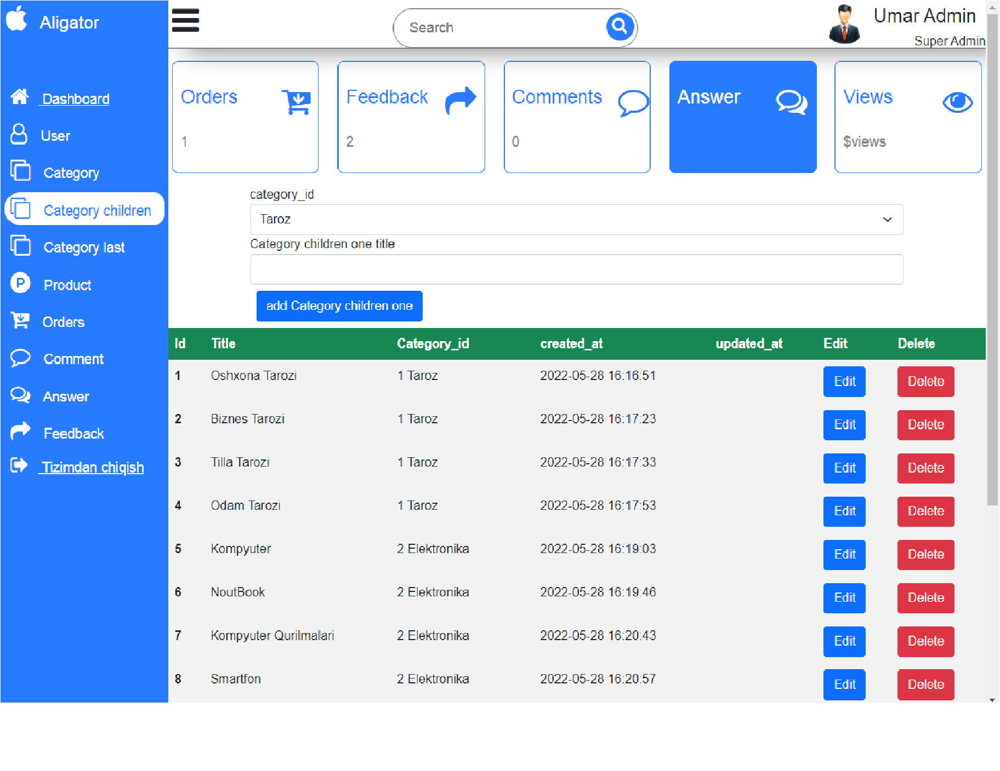

# laravel-9-Store-market

# Aligator

Laravel 8, Jquery, Vanilla JS, Ajax, Bootstrapt, HTML, CSS

### ajax pagination
### ajax sort product price ( low and top )

### ajax yordamida paginatsiya tovarlarga utish
### ajax yordamida tovarlarni arzon va qimmat qilib kurish

# Aligator site

# Alert answer your comments

# Sizning kommentarezga Javob berishgani xaqida xabar

Bunda siz yozgan komentariyaga kimlar javob yozganini uqib va ularga javob qaytariwingiz mumkin

# Site minicart
# Mini korzinka 

# Orders user send to Db
username, usermail, userphone, user orders

# Buyurtmalarni bazaga joylash
Bunda 
foydalanuvchini ismi, email, telefon raqami, va buyurtmasini Bazaga saqkab olamiz

# Ajax Search Product

# Ajax orqali maxsulotlarni qidiramiz

# Comments and Answer comment with Ajax

# Kommentariya va javob kommentariya Ajax bilan

# Product blade view
  Slider product image and zoom product image, carusel image

# Product blade saxifamizdi kurinishi 
  Bu saxifada Slider,carusel va rasmni kotta qilib kurish mumkin

# User Profile
  upload and delete avatar with AJAX

# Foydalanuvchi profile
  bu yerda rasmni ajax orqali yuklaw va uchiriw

# Site Admin Panel
  ## Delete ana edit , add Categories
  ## Creat, delete and update product
  ## moderat comments and delete comments
  ## Feedback 
  ## Orders
  ## and ...

# Sayt Admin paneli
  ## Categoriyalarni qushish, uchiriw, uzgartirish
  ## Tovarlarni quwiw
  ## tovarlarni uciriw
  ## Tovarlarni uzgartirish
  ## commentariyalarni moderatsiya qiliw va uchiriw
  ## Buyurtmalar bilan ishlash
  ## Saytga kelib tuwgan fikrlar bilan taniwiw ( ## FEEDBACK )
  ## va boshqalar ...

 

